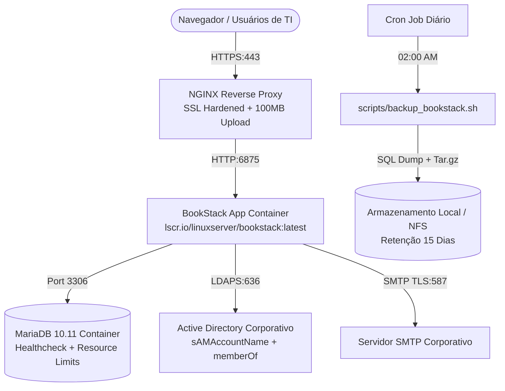

# 📚 BookStack Corporativo - Base de Conhecimento e Documentação Técnica de TI

Solução corporativa para implantação do **BookStack** em ambiente de produção de alta disponibilidade, com persistência completa, autenticação híbrida via Active Directory / OpenLDAP, terminação SSL com NGINX, rotina de Disaster Recovery automatizada e templates operacionais (POPs/SOPs).

---

## 🏗️ 1. Arquitetura da Solução



---

## 📂 2. Estrutura de Diretórios e Arquivos

```
bookstack/
├── docker-compose.yml              # Definição dos containers, volumes, redes e limits
├── .env.example                   # Modelo comentado de todas as variáveis de ambiente
├── custom-php/
│   └── php-custom.ini             # Ajustes de upload (100MB) e OPcache para PHP-FPM
├── nginx/
│   └── bookstack.conf             # VirtualHost com SSL, HSTS, CSP e proxy headers
├── scripts/
│   ├── backup_bookstack.sh        # Automação de backup (MariaDB + Uploads + SHA256)
│   └── restore_bookstack.sh       # Script guiado de restauração e Disaster Recovery
├── templates/
│   └── POP_TEMPLATE.md            # Modelo padronizado corporativo para artigos e POPs
├── OPERATIONAL_GUIDE.md           # Guia de pós-instalação, AD Group Mapping e Upgrades
└── README.md                      # Este guia de inicialização rápida
```

---

## 🚀 3. Guia de Inicialização Rápida (Quickstart)

### Pré-Requisitos:
- Servidor Linux (Ubuntu 22.04/24.04 LTS, Debian 12 ou RHEL 9/Rocky Linux).
- Docker Engine 24.0+ e Docker Compose v2.20+.
- NGINX instalado no host (ou proxy corporativo como Traefik/HAProxy).
- Acesso de rede liberado para:
  - Controlador de Domínio (Porta `636/TCP` LDAPS ou `389/TCP` LDAP).
  - Servidor SMTP (Porta `587/TCP` TLS ou `465/TCP` SSL).

---

### Passo 1: Clonar o projeto e criar o diretório de dados
```bash
cd /opt
sudo git clone https://github.com/tsathler/bookstack-docker-compose.git bookstack
cd /opt/bookstack

# Criar diretórios locais de persistência
mkdir -p data/app data/db backups
```

---

### Passo 2: Configurar o arquivo `.env`
Copie o modelo e preencha as credenciais da sua infraestrutura:
```bash
cp .env.example .env
chmod 600 .env
nano .env
```
> **Atenção:** Configure senhas fortes para `DB_PASS` e `MYSQL_ROOT_PASSWORD`, além de ajustar `APP_URL` com seu domínio HTTPS real.

---

### Passo 3: Ajustar permissões de execução dos scripts
```bash
chmod +x scripts/backup_bookstack.sh
chmod +x scripts/restore_bookstack.sh
```

---

### Passo 4: Inicializar a Stack Docker
```bash
docker compose up -d
```
Verifique o status da inicialização:
```bash
docker compose ps
docker compose logs -f
```

---

### Passo 5: Configurar o NGINX com SSL
1. Copie o arquivo de configuração para o NGINX do host:
   ```bash
   sudo cp nginx/bookstack.conf /etc/nginx/sites-available/bookstack.conf
   ```
2. Crie o link simbólico e recarregue o serviço:
   ```bash
   sudo ln -s /etc/nginx/sites-available/bookstack.conf /etc/nginx/sites-enabled/
   sudo nginx -t
   sudo systemctl reload nginx
   ```

---

## 🔐 4. Primeiro Acesso e Mapeamento de Funções

1. Acesse no navegador: `https://docs.empresa.com.br`
2. **Primeiro login com credencial local padrão:**
   - **E-mail:** `admin@admin.com`
   - **Senha:** `password`
   *(Altere imediatamente a senha nas configurações do usuário!)*
3. Siga as instruções do [Guia Operacional](OPERATIONAL_GUIDE.md) para:
   - Configurar o mapeamento dos grupos do Active Directory (`GG_TI_Admins`, `GG_TI_N2`, etc.).
   - Ativar o agendamento de backup diário no Cron.
   - Criar e armazenar a conta local de emergência no cofre corporativo.

---

## 📄 5. Utilização de Templates de POP / SOP

Todos os artigos de procedimentos operacionais e base de conhecimento N1/N2/N3 devem seguir a estrutura padronizada em:
👉 [`templates/POP_TEMPLATE.md`](templates/POP_TEMPLATE.md)

---

## 🛡️ 6. Suporte e Manutenção

Para procedimentos de upgrade, restauração de emergência e resolução de problemas técnicos, consulte o arquivo [`OPERATIONAL_GUIDE.md`](OPERATIONAL_GUIDE.md).
