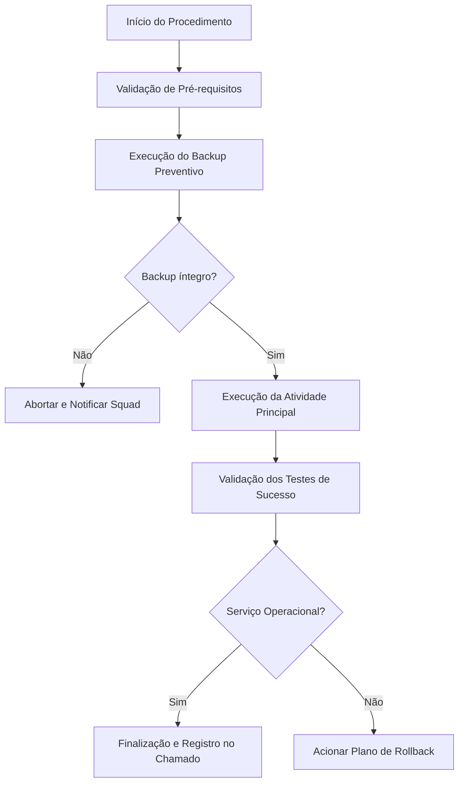

# POP-[TI-XXX] — [Título Resumido e Claro do Procedimento Operacional]

---

## 📋 Controle do Documento e Metadados

| Atributo | Detalhe |
| :--- | :--- |
| **Código do Documento:** | `POP-TI-001` (Ajustar conforme convenção interna) |
| **Versão Atual:** | `v1.0.0` |
| **Data de Publicação:** | `YYYY-MM-DD` |
| **Última Revisão:** | `YYYY-MM-DD` |
| **Autor Original:** | [Nome / Cargo / Squad] |
| **Revisor Técnico:** | [Nome / Cargo / Especialista] |
| **Aprovador (Gestão):** | [Coordenador / Gerente de TI] |
| **Nível de Atendimento:** | `[ ] N1 (Service Desk)` `[x] N2 (Suporte Avançado)` `[x] N3 (Engenharia)` |
| **Criticidade do Procedimento:** | `[ ] Baixa` `[ ] Média` `[x] Alta` `[ ] Crítica (Janela Obrigatória)` |
| **Janela de Manutenção:** | `[ ] Sim (Requer GMUD)` `[x] Não (Execução sob demanda)` |

---

## 1. 🎯 Objetivo
> *Descreva em 1 a 2 parágrafos a finalidade deste procedimento operacional, qual problema ele soluciona e qual o resultado esperado ao final de sua execução.*

Exemplo:
Este Procedimento Operacional Padrão (POP) estabelece as diretrizes e o passo a passo técnico para realizar a manutenção preventiva e aplicação de patches no cluster de banco de dados corporativo, garantindo a integridade dos dados e o mínimo impacto operacional.

---

## 2. 🌐 Escopo e Aplicabilidade
- **Sistemas/Serviços Afetados:** [Ex: Servidores Linux RHEL 9, Cluster MariaDB 10.11, Aplicações Web internas]
- **Equipes Elegíveis:** [Ex: Squad de Infraestrutura, Operações de TI, SRE]
- **Cenários de Aplicação:** [Ex: Manutenções agendadas, resposta a incidentes de performance, provisionamento de novas instâncias]
- **Fora do Escopo:** [Ex: Alterações no schema das tabelas das aplicações clientes]

---

## 3. 🔑 Pré-requisitos, Ferramentas e Permissões

### 3.1. Acessos e Credenciais
- [ ] Acesso SSH via VPN corporativa com chave assimétrica ou Bastion Host.
- [ ] Permissões de `sudo` no host alvo.
- [ ] Credenciais administrativas no cofre de senhas (ex: HashiCorp Vault / Bitwarden Corporativo).

### 3.2. Softwares e Ferramentas Necessárias
- Terminal Linux / WSL2 / PowerShell 7.
- `docker` (versão 24.0+) e `docker compose` (v2.20+).
- Cliente de banco de dados (ex: `mariadb-client` ou DBeaver).

### 3.3. Check de Pré-Execução (Healthcheck Inicial)
Antes de iniciar, execute e confirme:
```bash
# Verificar conectividade com o host
ping -c 3 srv-infra01.empresa.local

# Verificar uso de disco e memória antes do procedimento
df -h /var/lib/docker
free -m
```

---

## 4. 🗺️ Topologia e Diagrama do Procedimento



---

## 5. 🛠️ Procedimento Operacional Passo a Passo

> [!IMPORTANT]
> Nunca pule as etapas de validação de backup antes de realizar alterações estruturais em ambiente produtivo.

### Etapa 1: Notificação e Isolamento Inicial
1. Notificar no canal `#alerta-ti-operacoes` do Slack/Teams o início da execução:
   > *"Iniciando execução do POP-TI-001 no host srv-infra01. Janela estimada: 20 minutos."*
2. Isolar o nó no balanceador de carga ou colocar página de manutenção se aplicável.

---

### Etapa 2: Execução da Atividade Técnica

1. Acesse o servidor via SSH:
   ```bash
   ssh -i ~/.ssh/id_rsa_corp admin_user@srv-infra01.empresa.local
   ```

2. Navegue até o diretório da aplicação:
   ```bash
   cd /opt/servicos/minha-aplicacao
   ```

3. Execute o script de manutenção:
   ```bash
   sudo ./scripts/manutencao.sh --dry-run
   ```

> [!TIP]
> Utilize a flag `--verbose` caso necessite inspecionar logs detalhados durante o processamento.

4. Confirme a saída esperada do comando:
   ```text
   [INFO] Inspecionando tabelas... OK
   [INFO] Otimização concluída sem alertas.
   ```

---

### Etapa 3: Validação de Logs e Métricas
1. Verifique se existem erros críticos gerados nos últimos 5 minutos:
   ```bash
   docker compose logs --tail=100 -f | grep -iE 'error|fatal|exception'
   ```

---

## 6. ✅ Critérios de Sucesso e Validação Pós-Execução

Para considerar o procedimento concluído com êxito, todos os itens abaixo DEVEM ser validados:

- [ ] Todos os containers estão com status `healthy` (`docker compose ps`).
- [ ] O endpoint de healthcheck HTTP responde com status code `200 OK`:
  ```bash
  curl -k -s -o /dev/null -w "%{http_code}\n" https://docs.empresa.com.br/
  ```
- [ ] Login de usuário via Active Directory autentica sem atrasos.
- [ ] Criação de página de teste e upload de anexo executados com sucesso.
- [ ] Ausência de novas falhas no dashboard do Grafana/Zabbix.

---

## 7. 🔄 Plano de Rollback e Contingência

Caso ocorra falha crítica ou indisponibilidade prolongada superior a **15 minutos**:

> [!CAUTION]
> Ao iniciar o Rollback, registre imediatamente o incidente e comunique o Coordenador de Plantão.

1. **Parar a versão com falha:**
   ```bash
   docker compose down
   ```
2. **Restaurar os arquivos e o banco a partir do backup prévio:**
   ```bash
   sudo /opt/servicos/scripts/restore.sh /var/backups/ultimo_backup_valido.tar.gz
   ```
3. **Subir a versão anterior estável:**
   ```bash
   docker compose up -d
   ```
4. **Validar restabelecimento do serviço.**

---

## 8. 🔍 Resolução de Problemas (Troubleshooting & RCA)

| Sintoma / Erro | Causa Provável | Ação de Correção Recomendada |
| :--- | :--- | :--- |
| `HTTP 502 Bad Gateway` | Container da aplicação web parado ou iniciando | Verificar `docker compose ps` e inspecionar logs do PHP-FPM. |
| `LDAP Connection Refused (Port 636)` | Bloqueio de firewall ou certificado CA expirado | Testar com `openssl s_client -connect dc01.empresa.local:636` e checar rotas de firewall. |
| `Disk Full / No space left on device` | Logs do Docker ou uploads antigos saturando o disco | Executar `docker system prune -a --volumes` e verificar retenção de backups. |

---

## 9. 👥 Matriz RACI do Procedimento

- **Responsible (Quem executa):** Analista de Suporte N2 / Engenheiro DevOps.
- **Accountable (Quem responde pelo resultado):** Tech Lead / Coordenador de Infraestrutura.
- **Consulted (Quem é consultado para dúvidas):** Arquiteto de Soluções / Segurança da Informação.
- **Informed (Quem é informado da conclusão):** Service Desk N1 e Gerência de Operações.

---

## 10. 📝 Histórico de Revisões

| Versão | Data | Autor | Resumo das Alterações | Aprovado Por |
| :--- | :--- | :--- | :--- | :--- |
| `v1.0.0` | 2026-08-26 | Thiago Ferreira | Criação inicial do POP e padronização corporativa. | Coordenação TI |
| `v1.1.0` | YYYY-MM-DD | [Nome] | [Descrever alteração técnica realizada] | [Nome] |
